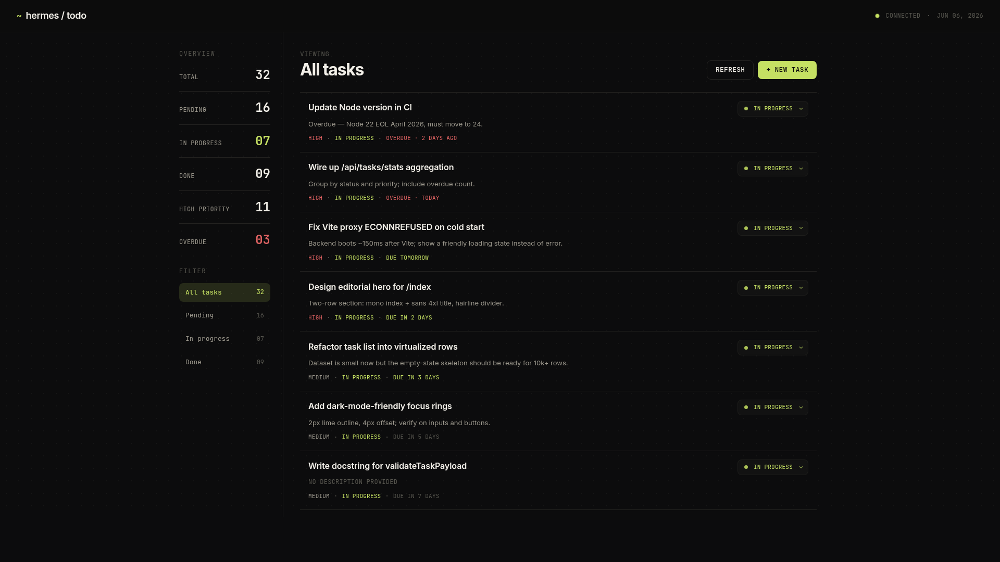

# hermes-todo

A task management application with a dark editorial aesthetic. SQLite-backed REST API (Express) + React 19 frontend (Vite).

> **Experiment note:** This entire application was built and iterated upon as a living experiment using [Hermes Agent](https://hermes-agent.nousresearch.com/). Every feature — from the initial scaffolding to the custom status picker, design token sync, root dev orchestrator, seed scripts, and screenshot automation — was directed and instructed by a human developer, with Hermes Agent acting as the execution layer. The commit history reflects atomic, conventional-commits-style changes produced during this iterative workflow.



## Structure

```
hermes-todo/
├── server/          # Express + better-sqlite3 API
│   ├── src/
│   │   ├── index.js
│   │   ├── db.js
│   │   └── routes/
│   │       └── tasks.js
│   └── package.json
└── client/          # React 19 + Vite
    ├── src/
    │   ├── main.jsx
    │   ├── App.jsx
    │   ├── styles/
    │   │   └── tokens.css    # Design tokens (extracted from personal-portfolio)
    │   ├── components/
    │   └── lib/
    │       └── api.js
    └── package.json
```

## Design Tokens

Colors, typography, spacing and motion extracted from `~/workspace/personal-portfolio/`:

- **Background**: `#0c0c0d` (deep black)
- **Text**: `#f2efe8` (warm off-white)
- **Muted**: `#9b978c`, **Faint**: `#57564f`
- **Accent**: `#c5e063` (lime)
- **Fonts**: Inter (sans) + JetBrains Mono (mono)
- **Spacing**: 4pt scale, **Radii**: 4/8/12 + pill
- **Borders**: 1px hairlines, focus outline 2px lime

## Setup

```bash
# Install all dependencies (root, server, client)
npm install

# Start both backend and frontend simultaneously
npm run dev          # → backend http://localhost:3001
                     # → frontend http://localhost:5173
```

Or run them separately:

```bash
# Backend
cd server
npm install
npm run dev          # → http://localhost:3001

# Frontend (in a separate terminal)
cd client
npm install
npm run dev          # → http://localhost:5173
```

## API

| Method | Endpoint             | Description           |
|--------|----------------------|-----------------------|
| GET    | `/api/tasks`         | List all tasks        |
| POST   | `/api/tasks`         | Create a task         |
| PATCH  | `/api/tasks/:id`     | Update a task         |
| DELETE | `/api/tasks/:id`     | Delete a task         |
| GET    | `/api/tasks/stats`   | Aggregate statistics  |

Task shape:
```json
{
  "id": 1,
  "title": "string",
  "description": "string | null",
  "status": "pending | in_progress | done",
  "priority": "low | medium | high",
  "due_date": "ISO string | null",
  "created_at": "ISO string",
  "updated_at": "ISO string"
}
```
